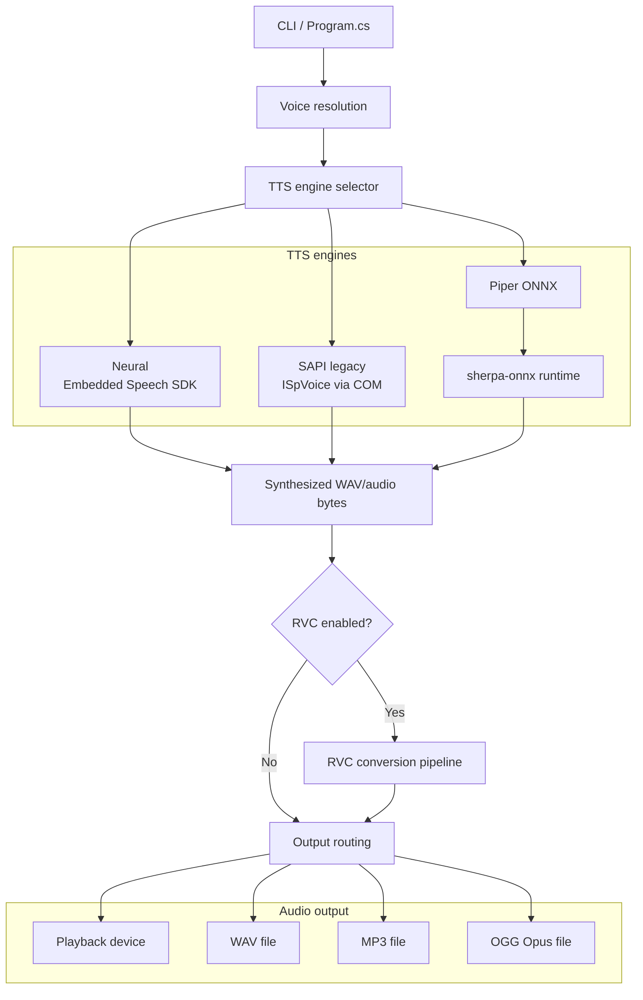
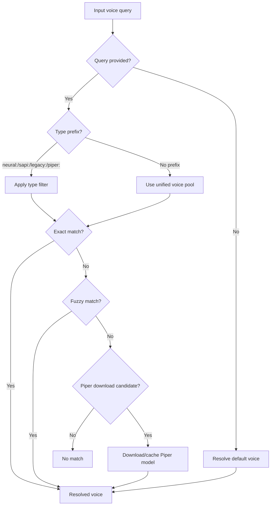
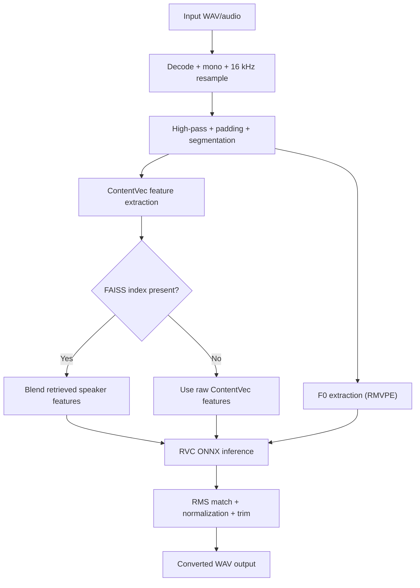
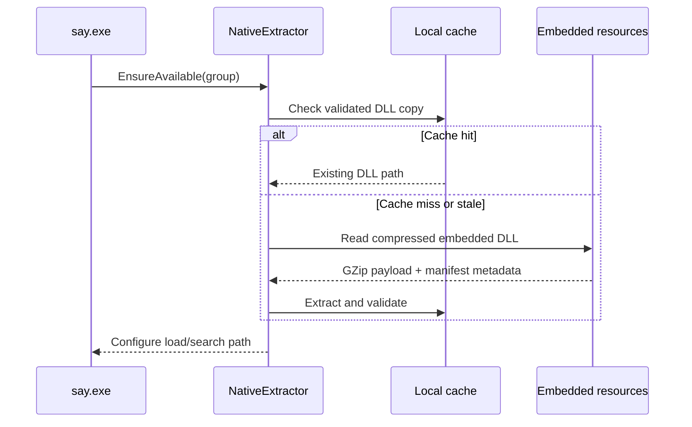
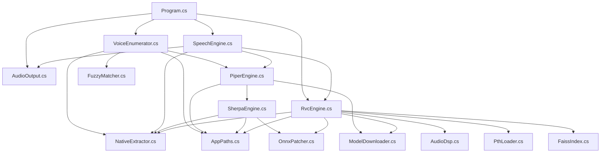

# Talktastic

[](https://dotnet.microsoft.com/)
[](https://learn.microsoft.com/dotnet/core/deploying/native-aot/)

Standalone Windows TTS CLI that speaks with neural, SAPI, and Piper voices -- with optional RVC voice conversion -- compiled to a single NativeAOT executable. No runtime, no installers, just `say.exe`.

## Features

- **Neural voices** -- Windows Embedded Speech SDK neural voices with full SSML support.
- **SAPI / legacy voices** -- classic Windows voices (David, Mark, Zira, etc.) via the classic SAPI5 engine (`ISpVoice`).
- **Piper voices** -- download and run open-source ONNX TTS models in-process (via sherpa-onnx).
- **RVC voice conversion** -- `.onnx` and `.pth` models with FAISS index support and DirectML GPU acceleration.
- **Multiple output formats** -- play to any audio device, or write `.wav`, `.mp3`, `.ogg` (Opus).
- **Multiple input formats** -- import `.wav`, `.mp3`, or `.ogg` files for RVC-only processing.
- **Zero dependencies** -- NativeAOT single-file binary with embedded native DLLs, extracted and cached at runtime.
- **Fuzzy matching** -- voice names are case-insensitive partial matches; type prefixes like `neural:`, `sapi:`, `piper:` narrow the search.
- **Model management** -- `--list`, `--rename-voice`, `--rename-rvc`, `--remove-voice`, `--remove-rvc`.
- **SSML** -- `--ssml` flag for neural voices, `--help-ssml` for examples.
- **Global pitch / rate** -- `--pitch`/`--rate` to modify the rate and pitch of the generated speech.

## Usage

```powershell
# Speak with the currently default Windows voice.
say "Hello, from Talktastic!"

# Use a Windows 11 neural voice (make sure to install it first; e.g via "say --add-voices"!)
say "This is Microsoft Ryan, a Windows 11 neural voice." -v "Microsoft Ryan"

# Download and use an Open Source Piper voice by URL (cached automatically).
say "Piper voices can be downloaded by URL!" -v "https://huggingface.co/rhasspy/piper-voices/tree/v1.0.0/en/en_US/amy/medium"

# Once a Piper voice is installed, you can use it by name.
say "Once a Piper voice is installed, you can use it by name!" -v "Amy"

# Silently download and install a Piper voice (also works with --rvc voice conversion packs!).
say -v "https://huggingface.co/rhasspy/piper-voices/tree/v1.0.0/en/en_US/ryan/high"

# Use type prefixes to disambiguate voices with the same name.
say "This is how you disambiguate between two voices with the same name." -v "piper:Ryan"

# RVC voice conversion models can be downloaded by URL too.
say "RVC models can also be downloaded by URL." --rvc "https://huggingface.co/0x3e9/Darth_Vader_RVC"

# Apply RVC voice conversion on top of any TTS voice.
say "This is Piper Alan's voice, converted to sound like Darth Vader." -v "https://huggingface.co/rhasspy/piper-voices/tree/v1.0.0/en/en_GB/alan/medium" --rvc "Vader"

# Read from stdin.
echo "You can also pipe text in from stdin!" | say "-"

# List everything -- voices, RVC models, audio devices.
say --list
```

## File I/O

Export to `.wav`, `.mp3`, or `.ogg` -- the extension picks the encoder:

```powershell
say "This will be saved as a WAV file." -o hello.wav
say "You can export to MP3 as well!" -v "Microsoft Aria" -o hello.mp3
say "And OGG Opus, if you fancy." -v "Amy" -o hello.ogg
```

Import `.wav`, `.mp3`, or `.ogg` files to run through RVC without doing TTS:

```powershell
say --in recording.wav --rvc "Homer" -o converted.wav
say --in podcast.mp3 --rvc "Homer" -o converted.mp3
say --in clip.ogg --rvc "Homer" -o converted.ogg
```

Mix and match any input format with any output format:

```powershell
say --in recording.wav --rvc "Homer" -o converted.ogg
say --in podcast.mp3 --rvc "Homer" -o converted.wav
```

## Advanced Usage

```powershell
# SSML for fine-grained speech control
say --ssml "<prosody rate='slow' pitch='-10%'>SSML lets you control rate, pitch, and emphasis.</prosody>"

# Rate and pitch shortcuts
say "Rate and pitch can also be set with shorthand flags." -v "Microsoft Aria" --rate fast --pitch high

# RVC pitch shifting (semitones: +12 = octave up, -12 = octave down)
say --in vocals.wav --rvc "Homer" --rvc-pitch 12 -o octave-up.wav

# TTS + RVC + file output -- the full pipeline
say "This runs the full pipeline: TTS, then RVC, then file export." -v "Microsoft Ryan" --rvc "Homer" -o result.mp3

# Play to a specific audio device
say "You can route audio to a specific output device." -v "Microsoft Ryan" -d "Speakers (Realtek)"

# Disable GPU acceleration (CPU-only RVC)
say --in input.wav --rvc "Homer" --no-gpu -o output.wav

# Show RVC pipeline timing
say "The perf flag shows RVC pipeline timing." --rvc "Homer" --perf

# Voice type prefixes narrow the search
say "Type prefixes let you pick exactly which engine to use." -v "neural:Aria"
say "This forces the SAPI engine." -v "sapi:David"

# Manage cached models
say --list-voices
say --list-rvcs
say --rename-voice "en_US-amy-medium=Amy"
say --rename-rvc "Homer=Homer Simpson"
say --remove-voice "Amy"
say --remove-rvc "Homer Simpson"
```

## Voice Types

| Voice type | Backing technology | Discovery source | Notes |
|---|---|---|---|
| Neural | Microsoft Embedded Speech SDK (Windows 11) | Installed `MicrosoftWindows.Voice.*` packages | Full SSML support; output format comes from `--format`. Requires Windows 11 neural voice packages. |
| SAPI / Legacy | Classic SAPI5 (`ISpVoice` via direct COM) | WinRT `SpeechSynthesizer.AllVoices` | Classic Windows voices (David, Mark, Zira, etc.). Limited SSML support -- most prosody tags are ignored. Uses classic SAPI5 for synthesis, so it works on Windows N/KN editions without the Media Feature Pack. |
| Piper | Open-source neural TTS via local ONNX models | `.piper-tts\voices` cache | Downloaded on demand from any URL and synthesized in-process via sherpa-onnx. Supports global rate and pitch controls. |

> **Windows N / KN editions:** These editions ship without Media Foundation (until the [Media Feature Pack](https://support.microsoft.com/topic/media-feature-pack-list-for-windows-n-editions-c1c6fffa-d052-8338-7a79-a4bb980a700a) is installed). Talktastic detects this and automatically routes audio playback through the classic `winmm waveOut` API instead of the WinRT media player, so device playback (including `--device` selection) works on N out of the box. Legacy/SAPI synthesis drives the classic SAPI5 `ISpVoice` engine via direct COM, which likewise has no Media Foundation dependency. When Media Foundation is present, the faster WinRT playback path is used.

> **Streaming playback:** When you do not pass `--device`, audio plays on the default output device and **streams as it is synthesized**, so speech starts before synthesis finishes -- neural voices via the Embedded Speech SDK, SAPI voices via `ISpVoice` rendering straight to the device, and Piper voices via a `winmm waveOut` FIFO fed from sherpa-onnx as each chunk is generated. RVC voice conversion (`--rvc`) also streams to the default device, playing each converted segment through the same FIFO as it is produced; note RVC still synthesizes the full source clip first (its pitch and feature extraction span the whole signal), so only the converted output streams, not the source. Selecting a specific `--device`, writing to a file (`--output`), or applying `--pitch` (for SAPI/Piper/neural voices) uses the buffered path instead. No temporary files are written -- all intermediate audio stays in memory.

> **RVC low-frequency "rumble" on constrained GPUs:** On memory-constrained DirectML GPUs (small embedded/integrated parts), long RVC conversions can intermittently produce a degenerate low-frequency drone instead of speech -- a soft inference corruption that leaves no Windows TDR/display-reset event. Talktastic detects this on the produced audio and prints a warning recommending a retry. CPU conversion (`--no-gpu`) is fully reliable; use it if you hit the rumble. Add `--verbose` to see the per-conversion zero-crossing/RMS diagnostics behind the detector.

## CLI Reference

```text
say [<text>] [options]
```

`<text>` is optional. Use `-` to read from stdin.

### Options

| Option | Meaning |
|---|---|
| `-v, --voice <voice>` | Voice name, partial match, case-insensitive. Supports prefixes like `piper:` and URL downloads. |
| `-o, --output <path>` | Output file path. Encoder chosen by extension: `.wav`, `.mp3`, `.ogg`. |
| `-d, --device <device>` | Output device name for playback. |
| `-i, --in <file>` | Process an existing `.wav`, `.mp3`, or `.ogg` through RVC (no TTS). |
| `--rvc <model>` | Apply RVC conversion using a local path, cached name, or URL. |
| `--rvc-pitch <semitones>` | Shift the RVC input pitch before conversion. |
| `-r, --rate <rate>` | Speech rate adjustment. |
| `-p, --pitch <pitch>` | Pitch adjustment (`high`, `low`, `+10%`, `-5st`, etc.). |
| `-f, --format <format>` | Speech SDK output format (neural voices). |
| `--ssml` | Treat input as SSML. |
| `--help-ssml` | Print SSML usage examples. |
| `-l, --list` | List voices, RVC models, and audio devices. |
| `--list-voices` | List voices only. |
| `--list-devices` | List output devices only. |
| `--list-rvcs` | List cached RVC models only. |
| `--remove-voice <name>` | Remove a cached Piper voice. |
| `--remove-rvc <name>` | Remove a cached RVC model. |
| `--rename-voice old=new` | Rename a cached Piper voice. |
| `--rename-rvc old=new` | Rename a cached RVC model. |
| `--add-voices` | Open the Windows "Add a voice" dialog. |
| `-q, --quiet` | Suppress stdout. |
| `-Q, --super-quiet` | Suppress stdout and stderr. |
| `--no-gpu` | Disable DirectML, fall back to CPU. |
| `--perf` | Emit timing data. |
| `--verbose` | Write detailed streaming/RVC diagnostics to stderr. |
| `-h, --help` | Show help. |
| `--version` | Show version. |

## Building

### Prerequisites

- Windows
- .NET 10 SDK
- NativeAOT publishing prerequisites for `win-x64` if you want the standalone single-file executable

### Build commands

```powershell
# Regular build
dotnet build

# Run directly from the build output
dotnet run -- "Hello, from source!"

# NativeAOT publish
dotnet publish -c Release -r win-x64 /p:PublishAot=true
```

The project file is configured to:

- build the executable as `say`
- gather native speech / ONNX / LAME assets via `build-resources.ps1`
- embed compressed native payloads and RVC skeleton models as resources
- exclude loose native DLLs from publish output when publishing AOT

At runtime, `NativeExtractor` validates or extracts the embedded native DLLs and configures the process to load them from the local cache.

## Testing

Run the standard test suite:

```powershell
dotnet test --nologo
```

Or use the repository test script for coverage reporting:

```powershell
pwsh .\test.ps1
pwsh .\test.ps1 -Html
```

The test suite covers:

- CLI behavior
- voice enumeration and fuzzy matching
- Piper and sherpa compatibility helpers
- RVC model loading, FAISS parsing, and `.pth` patching
- audio DSP and output encoding
- native resource extraction

## Architecture

<details>
<summary>High-level pipeline</summary>



</details>

<details>
<summary>Voice resolution</summary>



</details>

<details>
<summary>RVC pipeline</summary>



</details>

<details>
<summary>Native DLL extraction</summary>



</details>

<details>
<summary>Module dependency graph</summary>



</details>

## License

MIT
