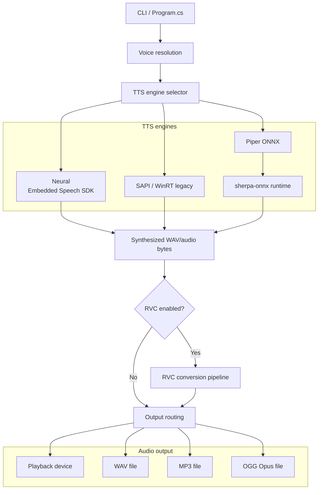
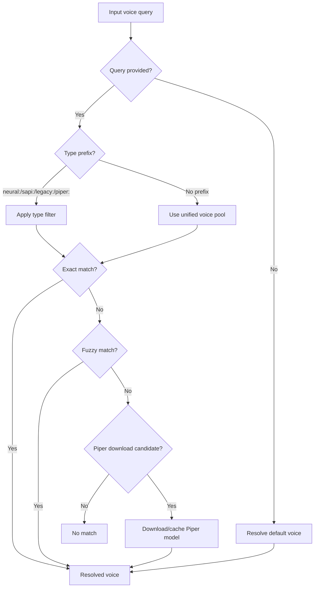
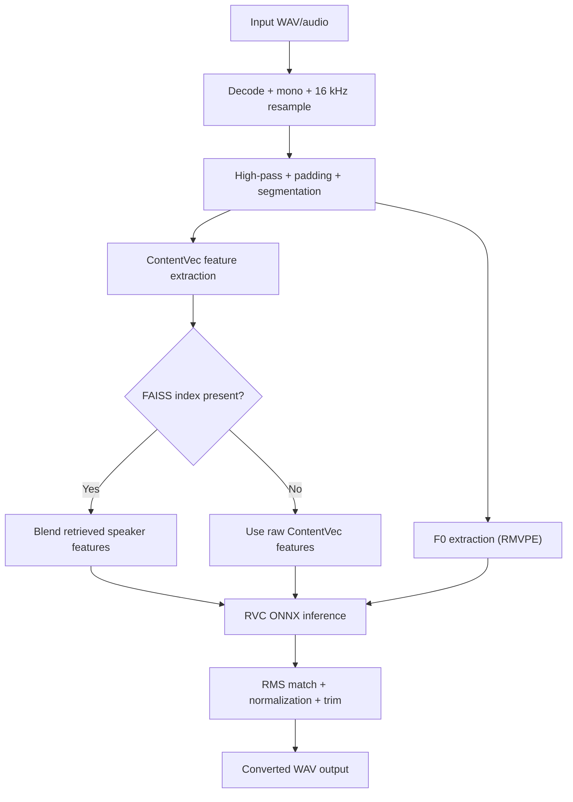
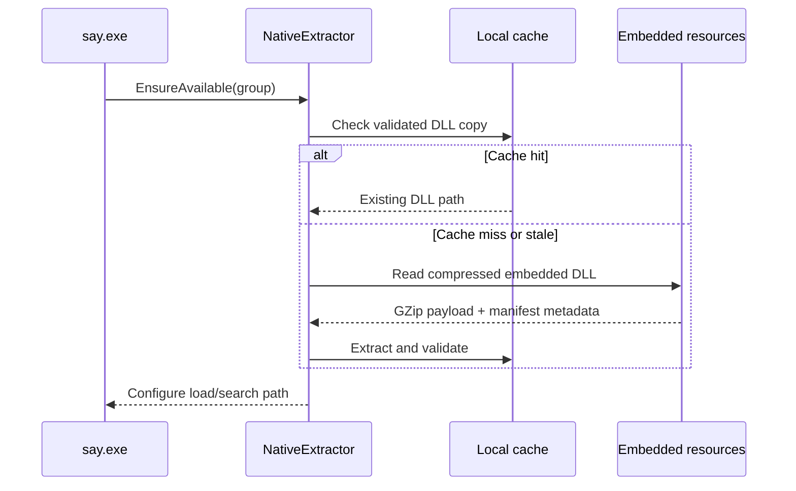
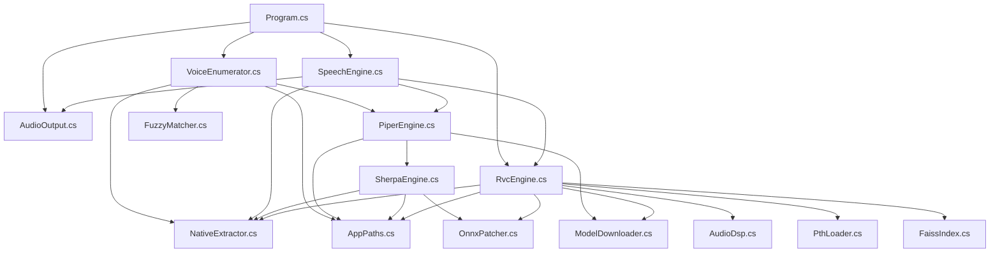

# Talktastic

[](https://dotnet.microsoft.com/)
[](https://learn.microsoft.com/dotnet/core/deploying/native-aot/)

Standalone Windows TTS CLI that speaks with neural, SAPI, and Piper voices -- with optional RVC voice conversion -- compiled to a single NativeAOT executable. No runtime, no installers, just `say.exe`.

## Usage

```powershell
# Speak with the default voice
say "Hello, from Talktastic!"

# Use a Windows neural voice
say "Good evening." -v "Microsoft Ryan"

# Use a Piper voice (downloaded and cached automatically)
say "Hello" -v "piper:en_US-ryan-high"

# Or download by URL
say "Hello" -v "https://huggingface.co/rhasspy/piper-voices/resolve/v1.0.0/en/en_US/amy/medium/en_US-amy-medium.onnx"

# Apply RVC voice conversion on top of any TTS voice
say "D'oh!" -v "Microsoft Aria" --rvc "Homer"

# RVC models can be downloaded by URL too
say "Hello" --rvc "https://huggingface.co/Sunwest/Homer_Simpson_300"

# Read from stdin
echo "Hello from a pipe" | say -

# List everything -- voices, RVC models, audio devices
say --list
```

## File I/O

Export to `.wav`, `.mp3`, or `.ogg` -- the extension picks the encoder:

```powershell
say "Hello" -o hello.wav
say "Hello" -v "Microsoft Aria" -o hello.mp3
say "Hello" -v "piper:en_GB-alan-medium" -o hello.ogg
```

Import `.wav`, `.mp3`, or `.ogg` files to run through RVC without doing TTS:

```powershell
say --in recording.wav --rvc "Homer" -o converted.wav
say --in podcast.mp3 --rvc "Homer" -o converted.mp3
say --in clip.ogg --rvc "Homer" -o converted.ogg
```

Mix and match any input format with any output format:

```powershell
say --in recording.wav --rvc "Homer" -o converted.ogg
say --in podcast.mp3 --rvc "Homer" -o converted.wav
```

## Advanced Usage

```powershell
# SSML for fine-grained speech control
say --ssml "<prosody rate='slow' pitch='-10%'>Take your time. There is no rush.</prosody>"

# Rate and pitch shortcuts (neural and SAPI voices)
say "Hurry up!" -v "Microsoft Aria" --rate fast --pitch high

# RVC pitch shifting (semitones: +12 = octave up, -12 = octave down)
say --in vocals.wav --rvc "Homer" --rvc-pitch 12 -o octave-up.wav

# TTS + RVC + file output -- the full pipeline
say "This is a test of the full pipeline." -v "Microsoft Ryan" --rvc "Homer" -o result.mp3

# Play to a specific audio device
say "Hello" -v "Microsoft Ryan" -d "Speakers (Realtek)"

# Disable GPU acceleration (CPU-only RVC)
say --in input.wav --rvc "Homer" --no-gpu -o output.wav

# Show RVC pipeline timing
say "Hello" --rvc "Homer" --perf

# Voice type prefixes narrow the search
say "Hello" -v "neural:Aria"
say "Hello" -v "sapi:David"
say "Hello" -v "piper:en_US-amy-medium"

# Manage cached models
say --list-voices
say --list-rvcs
say --rename-voice "en_US-amy-medium=Amy"
say --rename-rvc "Homer=Homer Simpson"
say --remove-voice Amy
say --remove-rvc "Homer Simpson"
```

## Features

- **Neural voices** -- Windows Embedded Speech SDK neural voices with full SSML support
- **SAPI / legacy voices** -- classic Windows voices via WinRT
- **Piper voices** -- download and run open-source ONNX TTS models in-process (via sherpa-onnx)
- **RVC voice conversion** -- `.onnx` and `.pth` models with FAISS index support, DirectML GPU acceleration
- **Multiple output formats** -- play to any audio device, or write `.wav`, `.mp3`, `.ogg` (Opus)
- **Multiple input formats** -- import `.wav`, `.mp3`, or `.ogg` for RVC-only processing
- **Zero dependencies** -- NativeAOT single-file binary with embedded native DLLs, extracted and cached at runtime
- **Fuzzy matching** -- voice names are case-insensitive partial matches; type prefixes like `neural:`, `sapi:`, `piper:` narrow the search
- **Model management** -- `--list`, `--rename-voice`, `--rename-rvc`, `--remove-voice`, `--remove-rvc`
- **SSML** -- `--ssml` flag, `--help-ssml` for examples, `--rate`/`--pitch` shortcuts

## Architecture

### High-level pipeline



### Voice resolution



### RVC pipeline



### Native DLL extraction



### Module dependency graph



## Voice Types

| Voice type | Backing technology | Discovery source | Notes |
|---|---|---|---|
| Neural | Microsoft Embedded Speech SDK | Installed `MicrosoftWindows.Voice.*` packages | Best SSML support; output format comes from `--format`. |
| SAPI / Legacy | WinRT `SpeechSynthesizer` voice inventory | `SpeechSynthesizer.AllVoices` | Covers classic Windows voices such as David/Mark/Zira-style voices. |
| Piper | Local ONNX model files | `.piper-tts\voices` cache | User-facing local models; downloaded on demand and synthesized in-process. |
| Sherpa runtime | `org.k2fsa.sherpa.onnx` | Not a separate voice catalog | Execution backend for Piper models, plus token/espeak/metadata compatibility work. |

> Note: `VoiceEnumerator` exposes user-selectable voice families as Neural, Legacy, and Piper. sherpa-onnx is the Piper execution backend, not a separate enumerated voice inventory.

## CLI Reference

```text
say [<text>] [options]
```

`<text>` is optional. Use `-` to read from stdin.

### Options

| Option | Meaning |
|---|---|
| `-v, --voice <voice>` | Voice name, partial match, case-insensitive. Supports prefixes like `piper:` and URL downloads. |
| `-o, --output <path>` | Output file path. Encoder chosen by extension: `.wav`, `.mp3`, `.ogg`. |
| `-d, --device <device>` | Output device name for playback. |
| `-i, --in <file>` | Process an existing `.wav`, `.mp3`, or `.ogg` through RVC (no TTS). |
| `--rvc <model>` | Apply RVC conversion using a local path, cached name, or URL. |
| `--rvc-pitch <semitones>` | Shift the RVC input pitch before conversion. |
| `-r, --rate <rate>` | Speech rate adjustment. |
| `-p, --pitch <pitch>` | Pitch adjustment (`high`, `low`, `+10%`, `-5st`, etc.). |
| `-f, --format <format>` | Speech SDK output format (neural voices). |
| `--ssml` | Treat input as SSML. |
| `--help-ssml` | Print SSML usage examples. |
| `-l, --list` | List voices, RVC models, and audio devices. |
| `--list-voices` | List voices only. |
| `--list-devices` | List output devices only. |
| `--list-rvcs` | List cached RVC models only. |
| `--remove-voice <name>` | Remove a cached Piper voice. |
| `--remove-rvc <name>` | Remove a cached RVC model. |
| `--rename-voice old=new` | Rename a cached Piper voice. |
| `--rename-rvc old=new` | Rename a cached RVC model. |
| `--add-voices` | Open the Windows "Add a voice" dialog. |
| `-q, --quiet` | Suppress stdout. |
| `-Q, --super-quiet` | Suppress stdout and stderr. |
| `--no-gpu` | Disable DirectML, fall back to CPU. |
| `--perf` | Emit timing data. |
| `-h, --help` | Show help. |
| `--version` | Show version. |

## Building

### Prerequisites

- Windows
- .NET 10 SDK
- NativeAOT publishing prerequisites for `win-x64` if you want the standalone single-file executable

### Build commands

```powershell
# Regular build
dotnet build

# Run directly from the build output
dotnet run -- "Hello from source"

# NativeAOT publish
dotnet publish -c Release -r win-x64 /p:PublishAot=true
```

The project file is configured to:

- build the executable as `say`
- gather native speech / ONNX / LAME assets via `build-resources.ps1`
- embed compressed native payloads and RVC skeleton models as resources
- exclude loose native DLLs from publish output when publishing AOT

At runtime, `NativeExtractor` validates or extracts the embedded native DLLs and configures the process to load them from the local cache.

## Testing

Run the standard test suite:

```powershell
dotnet test --nologo
```

Or use the repository test script for coverage reporting:

```powershell
pwsh .\test.ps1
pwsh .\test.ps1 -Html
```

The test suite covers:

- CLI behavior
- voice enumeration and fuzzy matching
- Piper and sherpa compatibility helpers
- RVC model loading, FAISS parsing, and `.pth` patching
- audio DSP and output encoding
- native resource extraction

## License

MIT
