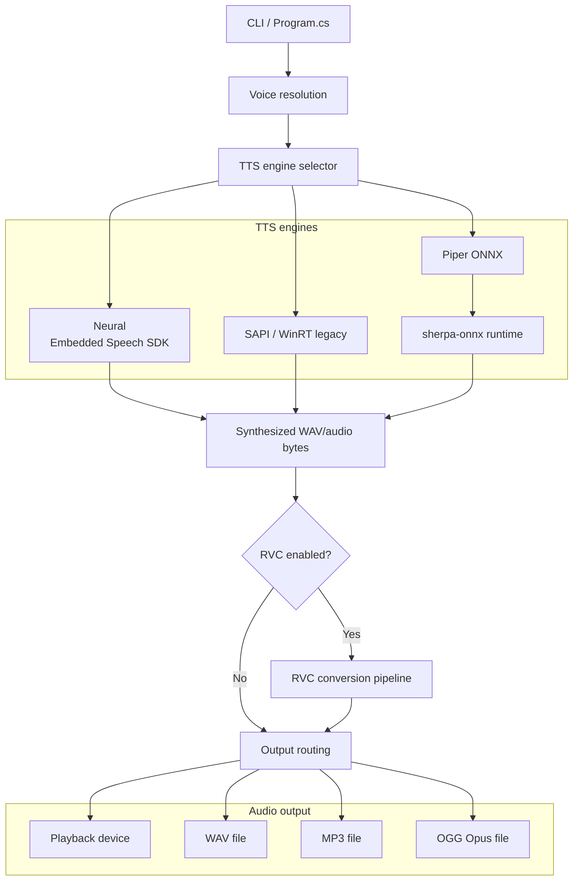
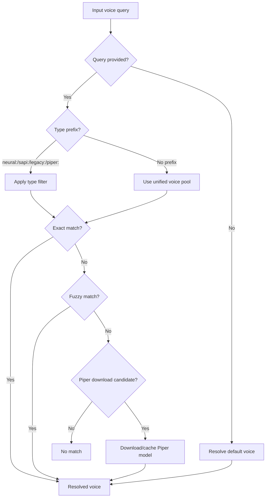
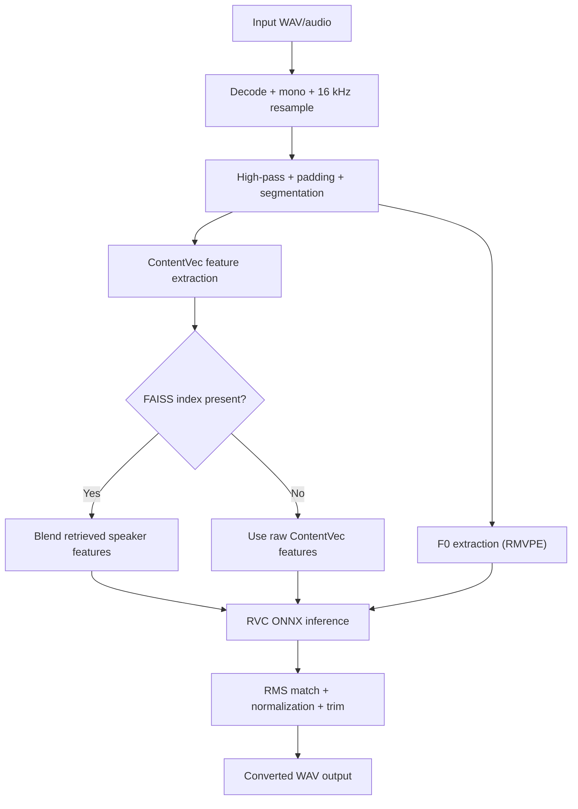
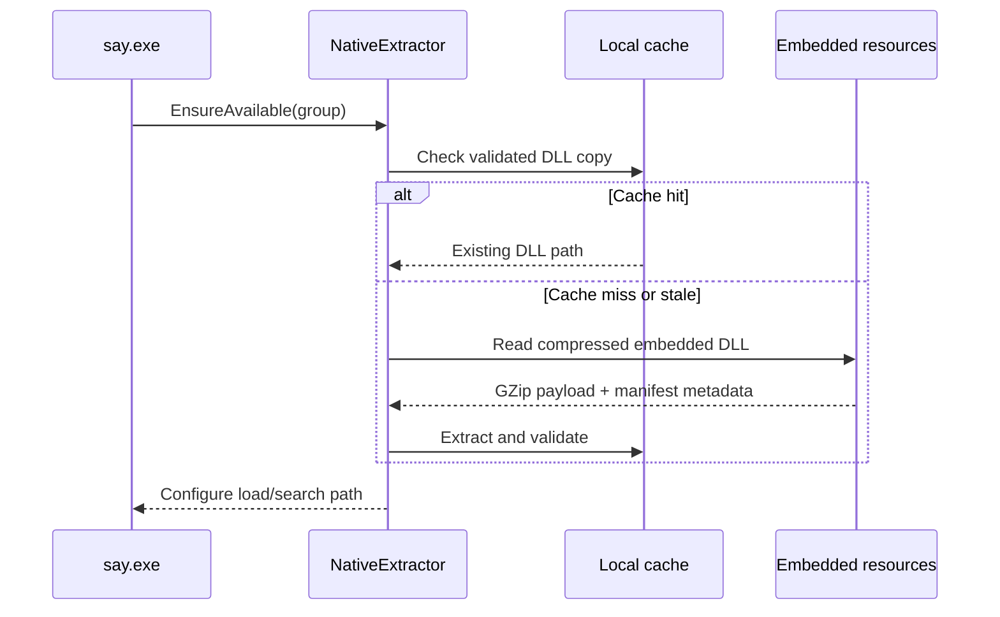
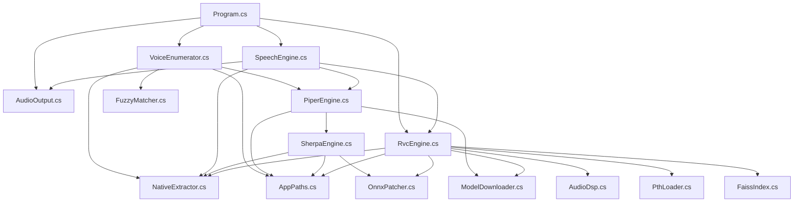

# Talktastic

[](https://dotnet.microsoft.com/)
[](https://learn.microsoft.com/dotnet/core/deploying/native-aot/)
[](#license)

Talktastic is a standalone Windows text-to-speech CLI built in C# on .NET 10. It can speak with Windows neural voices, legacy SAPI/WinRT voices, locally cached Piper models, and optionally run the result through RVC voice conversion before playing audio or writing `.wav`, `.mp3`, or `.ogg` files.

The project is designed to publish as a single NativeAOT `say.exe` with embedded native dependencies extracted at runtime, so end users do not need to install separate speech or ONNX runtimes.

## Overview

At a high level, Talktastic does four things:

1. Resolves a voice name from installed Windows voices or cached local models.
2. Synthesizes speech with the appropriate engine:
   - Embedded Speech SDK for Windows neural voices
   - WinRT speech synthesis for legacy voices
   - sherpa-onnx for Piper ONNX models
3. Optionally converts the synthesized audio through an RVC model.
4. Plays the result to a selected output device or writes it to disk.

Key runtime data lives under Talktastic-managed application folders, searched in this order:

1. `%LOCALAPPDATA%\Talktastic`
2. `%TEMP%`
3. The current working directory

## Features

- Standalone Windows CLI with a single entry point: `say.exe`
- .NET 10 / NativeAOT-friendly architecture
- Windows neural voice synthesis via Embedded Speech SDK
- Legacy Windows voice synthesis via WinRT/SAPI-compatible voice inventory
- Piper ONNX voice download, caching, and in-process synthesis
- sherpa-onnx integration with automatic token and metadata patching for Piper models
- RVC voice conversion for `.onnx` and `.pth` models
- Automatic download of RVC infrastructure models (`ContentVec`, `RMVPE`)
- Optional FAISS `.index` retrieval for RVC speaker embedding refinement
- Multiple output targets: default speaker, named device, WAV, MP3, OGG Opus
- SSML support for neural and legacy voices
- Fuzzy voice/model matching with type prefixes such as `neural:`, `sapi:`, and `piper:`
- Download, rename, remove, and cache management for Piper and RVC assets

## Quick Start

```powershell
# Speak with the default voice
say.exe "Hello from Talktastic"

# Pick a Windows voice
say.exe "Hello" --voice "Microsoft David"

# Save to a file (extension selects encoder)
say.exe "Hello" --voice "Microsoft Aria" --output .\hello.mp3

# Use stdin
"Hello from stdin" | say.exe -

# List voices, RVC models, and devices
say.exe --list

# Download and use a Piper model by shorthand
say.exe "Hello" --voice "piper:en_US-ryan-high"

# Apply RVC after TTS
say.exe "Witness the trenchcoat" --voice "Microsoft Aria" --rvc ".\.rvc\voices\GLaDOS\GLaDOS.onnx"

# Convert an existing audio file through RVC only
say.exe --in .\input.wav --rvc ".\.rvc\voices\GLaDOS\GLaDOS.onnx" --output .\converted.ogg
```

## Architecture

### High-level pipeline



### Voice resolution



### RVC pipeline



### Native DLL extraction



### Module dependency graph



## Voice Types

| Voice type | Backing technology | Discovery source | Notes |
|---|---|---|---|
| Neural | Microsoft Embedded Speech SDK | Installed `MicrosoftWindows.Voice.*` packages | Best SSML support; output format comes from `--format`. |
| SAPI / Legacy | WinRT `SpeechSynthesizer` voice inventory | `SpeechSynthesizer.AllVoices` | Covers classic Windows voices such as David/Mark/Zira-style voices. |
| Piper | Local ONNX model files | `.piper-tts\voices` cache | User-facing local models; downloaded on demand and synthesized in-process. |
| Sherpa runtime | `org.k2fsa.sherpa.onnx` | Not a separate voice catalog | Execution backend for Piper models, plus token/espeak/metadata compatibility work. |

> Note: `VoiceEnumerator` exposes user-selectable voice families as Neural, Legacy, and Piper. sherpa-onnx is the Piper execution backend, not a separate enumerated voice inventory.

## CLI Reference

Usage:

```text
say [<text>] [options]
```

`<text>` is optional. Use `-` to read from stdin.

### Options

| Option | Meaning |
|---|---|
| `-v, --voice <voice>` | Voice name, partial match, case-insensitive. Supports prefixes like `piper:` and URL downloads. |
| `-o, --output <path>` | Output file path. Actual encoder is chosen by extension: `.wav`, `.mp3`, `.ogg`. |
| `-d, --device <device>` | Output device name for playback. |
| `-l, --list` | List voices, RVC models, and audio devices. |
| `--list-voices` | List voices only. |
| `--list-devices` | List output devices only. |
| `--list-rvcs` | List cached RVC models only. |
| `--remove-voice <name>` | Remove a cached Piper voice. |
| `--remove-rvc <name>` | Remove a cached RVC model. |
| `--rename-voice old=new` | Rename a cached Piper voice. |
| `--rename-rvc old=new` | Rename a cached RVC model. |
| `-r, --rate <rate>` | Speech rate adjustment. |
| `-p, --pitch <pitch>` | Pitch adjustment (`high`, `low`, `+10%`, `-5st`, etc.). |
| `--rvc <model>` | Apply RVC conversion using a local path or URL. |
| `-i, --in <file>` | Process an existing `.wav`, `.mp3`, or `.ogg` through RVC without doing TTS. |
| `--rvc-pitch <semitones>` | Shift the RVC input pitch before conversion. |
| `-f, --format <format>` | Speech SDK output format. Primarily relevant for neural synthesis. |
| `--ssml` | Treat input as SSML. |
| `--help-ssml` | Print SSML usage examples. |
| `--add-voices` | Open the Windows “Add a voice” dialog. |
| `-q, --quiet` | Suppress stdout. |
| `-Q, --super-quiet` | Suppress stdout and stderr. |
| `--no-gpu` | Disable DirectML for RVC and fall back to CPU where applicable. |
| `--perf` | Emit RVC and native extraction timing data. |
| `-h, --help` | Show help. |
| `--version` | Show version information. |

### Common examples

```powershell
# Default voice
say.exe "Hello"

# Prefix-filtered voice selection
say.exe "Hello" --voice "neural:Aria"
say.exe "Hello" --voice "sapi:David"
say.exe "Hello" --voice "piper:en_US-amy-medium"

# Write different formats
say.exe "Hello" --output .\hello.wav
say.exe "Hello" --output .\hello.mp3
say.exe "Hello" --output .\hello.ogg

# SSML
say.exe --ssml "<prosody rate='slow'>Hello there.</prosody>"
say.exe --help-ssml

# Cache-only download flows
say.exe --voice "https://huggingface.co/rhasspy/piper-voices/resolve/v1.0.0/en/en_US/amy/medium/en_US-amy-medium.onnx"
say.exe --rvc "https://huggingface.co/Sunwest/Homer_Simpson_300"

# RVC-only conversion
say.exe --in .\dry.wav --rvc ".\.rvc\voices\Homer\Homer.onnx" --rvc-pitch 12 --output .\wet.mp3

# Inventory / management
say.exe --list
say.exe --rename-voice "en_US-amy-medium=Amy"
say.exe --rename-rvc "OldModel=NewModel"
```

### Behavioral notes

- Voice resolution order is effectively: empty query -> default voice, otherwise exact match -> fuzzy match -> optional Piper download -> error if nothing matches.
- When no voice is specified, Talktastic prefers the current Narrator/system voice and upgrades to a neural equivalent when possible.
- `--ssml` cannot be combined with `--rate` or `--pitch`.
- `--in` requires `--rvc`.
- Management operations (`--remove-*`, `--rename-*`) are mutually exclusive.
- For Piper synthesis, SSML tags are stripped to plain text because Piper itself is not SSML-aware.

## Building

### Prerequisites

- Windows
- .NET 10 SDK
- NativeAOT publishing prerequisites for `win-x64` if you want the standalone single-file executable

### Build commands

```powershell
# Regular build
dotnet build

# Run directly from the build output
dotnet run -- "Hello from source"

# NativeAOT publish
dotnet publish -c Release -r win-x64 /p:PublishAot=true
```

The project file is configured to:

- build the executable as `say`
- gather native speech / ONNX / LAME assets via `build-resources.ps1`
- embed compressed native payloads and RVC skeleton models as resources
- exclude loose native DLLs from publish output when publishing AOT

At runtime, `NativeExtractor` validates or extracts the embedded native DLLs and configures the process to load them from the local cache.

## Testing

Run the standard test suite:

```powershell
dotnet test --nologo
```

Or use the repository test script for coverage reporting:

```powershell
pwsh .\test.ps1
pwsh .\test.ps1 -Html
```

The test suite covers:

- CLI behavior
- voice enumeration and fuzzy matching
- Piper and sherpa compatibility helpers
- RVC model loading, FAISS parsing, and `.pth` patching
- audio DSP and output encoding
- native resource extraction

## License

No `LICENSE` file is currently present in this repository.

The previous README ended with “For educational purposes,” but that is not a standard software license. Until a license file is added, treat the repository license as unspecified.
